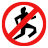

# Unmovable

Disables left-click to "walk here". To walk, hold shift + left-click. 

## Motivation
Unmovable can help in kiting, or any area where misclicks have a high cost. In kiting, it prevents a misclick on your foe
from causing you to walk towards them. 
